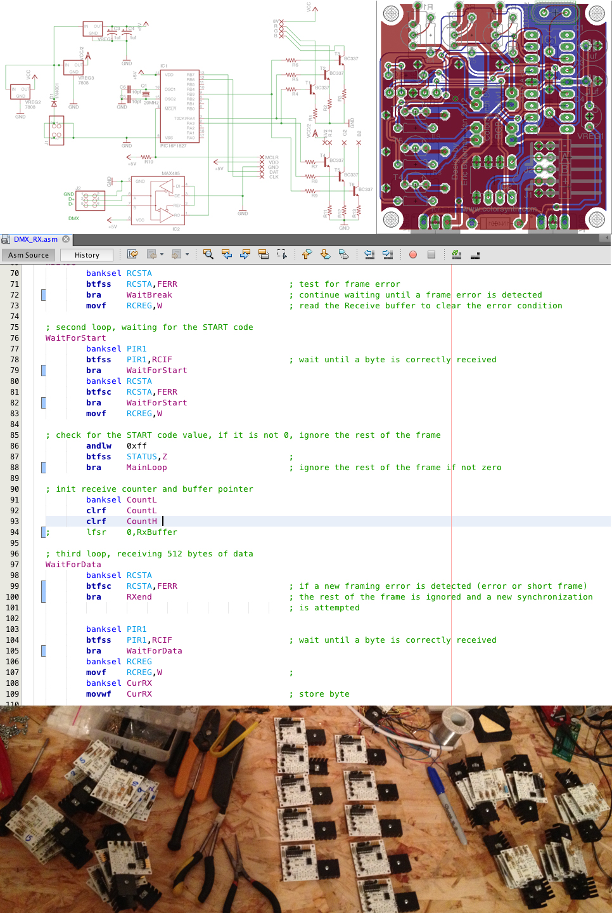

# ColorSynth-DMX 
163 DMX RGB pixels for a Burningman 2013 geodesic dome located at camp Morning Cookie 
Designed and assembled by Eric Bateman 
BMP to DMX mapping done in collaboration with Craig Dorety (http://craigdorety.com/) 

ColorSynth DMX RGX pixels are three channel DMX fixtures.  Programmed in assembly, the channels are software defined.
